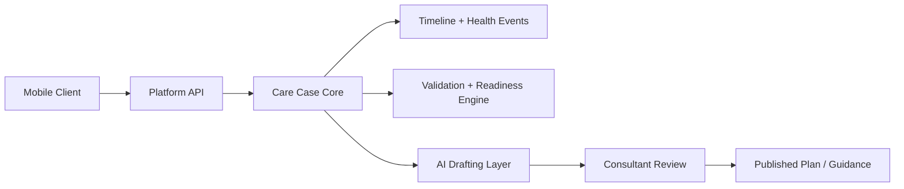

# 00 Product Constitution

## Purpose

This document defines the non-negotiable operating rules for the Fiteatsy ecosystem. It is the master reference for product, engineering, AI, clinical safety, UX, and data governance decisions.

## Scope

Applies to:

- Fiteatsy mobile app
- Fiteatsy backend platform
- Consultant and admin dashboards, including the practitioner workspace
- AI pipelines, event systems, and clinical review flows

Related documents:

- [01 Product Vision](/Users/l.paunikar/Desktop/fiteatsy-mobile/docs/01_PRODUCT_VISION.md)
- [02 Platform Architecture](/Users/l.paunikar/Desktop/fiteatsy-mobile/docs/02_PLATFORM_ARCHITECTURE.md)
- [17 Decision Log](/Users/l.paunikar/Desktop/fiteatsy-mobile/docs/17_DECISION_LOG.md)

## Platform Vision

Fiteatsy exists to transform fragmented health inputs into a longitudinal recovery system where clients, consultants, mentors, and administrators operate from one structured care model.

## Mission

Enable every client to move from enrollment to measurable health improvement through validated data capture, consultant-led interpretation, and safe AI acceleration.

## Core Principles

1. Care cases are the primary operating unit.
2. Health data must be structured before it becomes actionable.
3. AI may accelerate decisions, but clinicians remain accountable for care publication.
4. Backend services own calculations, readiness, and lifecycle transitions.
5. Every meaningful action must be explainable through timeline events and audit trails.
6. Product language must stay client-friendly in the app and operationally precise in internal tools.

## Healthcare Philosophy

- Recovery is longitudinal, not transactional.
- Health change requires adherence, education, measurement, and follow-up.
- Biomarkers, habits, symptoms, and lived context are all first-class inputs.
- Every client journey should support prevention, correction, and sustained maintenance.

## AI Philosophy

- AI is a copilot, not an autonomous clinician.
- AI outputs must be grounded in structured context, clinical rules, and auditability.
- Confidence, readiness, and guardrails are mandatory before AI recommendations surface to staff.
- AI must never publish a final diet or medical recommendation without human approval.

## Product Philosophy

- Minimize duplicate data collection.
- Use a single source of truth for identity, DOB, gender, consultant assignment, and care stage.
- Prefer progressive completion over long one-time forms.
- Build for continuity: onboarding, reports, follow-up, and guidance should feel like one system.

## Engineering Philosophy

- Domain logic belongs in the backend.
- UI should consume contracts, not recreate business rules.
- Event-driven history is preferred over opaque state mutation.
- Systems must be backward compatible during migration periods.

## UX Philosophy

- Respect the existing visual language unless a documented UX issue requires improvement.
- Accessibility, contrast, and motion restraint are mandatory.
- Empty, loading, and error states are part of the experience, not exceptions.
- Use plain client-facing language in the mobile app: for example, "Health Profile Completion".

## Clinical Philosophy

- Nutrition care depends on data completeness, not just questionnaire completion.
- Clinical validation must combine biomarker interpretation, behavioral context, and consultant judgment.
- Risk must be triaged into visible tickets, not buried in hidden logic.

## Security Principles

- Least privilege for data access.
- Encryption in transit and at rest.
- Audit logging for sensitive actions.
- No personal data sale or non-care exploitation.

## Data Ownership Principles

- Clients own their personal health data.
- Consultants access only assigned client information required for care delivery.
- Admin views are operational and analytic, not a substitute for direct care workflows.
- Aggregated insights may inform platform operations; raw data access must remain role-scoped.

## Definition Of Done

Work is complete only when:

- Business rules align with these docs
- API and model impacts are documented
- Accessibility and error states are handled
- Audit, event, or notification implications are considered
- Tests or validation steps are updated
- Any architecture change is reflected in [17 Decision Log](/Users/l.paunikar/Desktop/fiteatsy-mobile/docs/17_DECISION_LOG.md)

## Decision-Making Rules

1. Prefer one canonical model over duplicated local state.
2. Prefer additive, backward-compatible change over breaking rewrites.
3. Prefer event emission when lifecycle, communication, or analytics consumers exist.
4. Prefer consultant review over automation when client safety is affected.

## Coding Rules

- Type contracts must be explicit.
- Calculation utilities should be deterministic and testable.
- Screens should not hide domain rules in styling or component state.
- Naming should match documented domain language.

## Platform Rules

- Care case stages may only change through backend lifecycle logic.
- Health profile completion and readiness are backend-owned metrics.
- Consultant assignment is platform-driven and synced outward.
- Report processing milestones must emit platform events.

## Repository Rules

- This repository is the source of truth for mobile plus backend platform definitions.
- Cross-product integrations, including practitioner workflows, must reference these docs.
- No new module should be added without clarifying its domain boundary in [02 Platform Architecture](/Users/l.paunikar/Desktop/fiteatsy-mobile/docs/02_PLATFORM_ARCHITECTURE.md).

## Documentation Rules

- Docs must describe real or target-state architecture clearly.
- Terminology conflicts must be resolved here first.
- New major decisions require an ADR entry in [17 Decision Log](/Users/l.paunikar/Desktop/fiteatsy-mobile/docs/17_DECISION_LOG.md).

## Architecture Overview

## Responsibilities

- Product: preserve care continuity and reduce redundant intake
- Engineering: implement stable contracts and safe migrations
- Clinical: define validation rules and approval boundaries
- AI: assist within guardrails and observable workflows
- Design: ensure accessible, coherent, low-friction interfaces

## Future Expansion Notes

- Nuetra brand integration should reuse the same core care-case architecture.
- Mentor OS and consultant OS should be layered on shared domain events, not forked data models.

## Implementation Considerations

- Existing local-storage-driven mobile features should gradually converge on platform APIs.
- Historical age-only data must be migrated toward DOB-backed age calculation.
- Any mismatch between mobile wording and consultant wording should be deliberate and documented.
