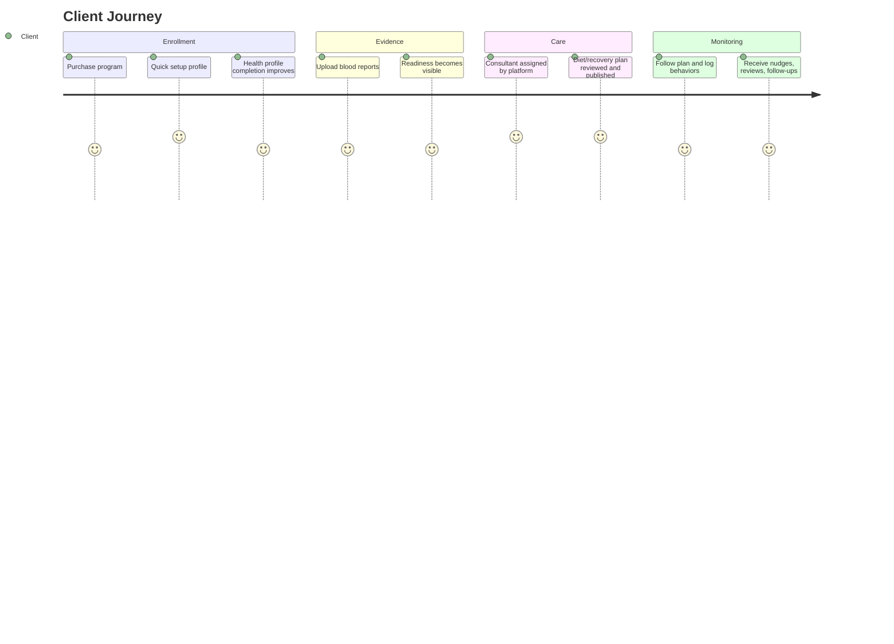

# 01 Product Vision

## Purpose

Define why Fiteatsy exists, who it serves, and what end-to-end outcomes the platform must produce.

## Scope

This vision covers the client mobile app, the backend care platform, and the consultant/admin operating surfaces.

Related documents:

- [00 Product Constitution](/Users/l.paunikar/Desktop/fiteatsy-mobile/docs/00_PRODUCT_CONSTITUTION.md)
- [07 Care Case Lifecycle](/Users/l.paunikar/Desktop/fiteatsy-mobile/docs/07_CARE_CASE_LIFECYCLE.md)
- [16 Product Roadmap](/Users/l.paunikar/Desktop/fiteatsy-mobile/docs/16_PRODUCT_ROADMAP.md)

## Why Fiteatsy Exists

Most health programs fail because intake data is incomplete, biomarker interpretation is slow, care handoffs are fragmented, and follow-up lacks structure. Fiteatsy exists to turn enrollment, assessment, reports, nutrition profiling, consultant review, and monitoring into one connected recovery workflow.

## Problems It Solves

- Repeated collection of the same profile data
- Manual, unstructured consultant intake
- Report uploads without operational follow-through
- Invisible risk signals and poor task coordination
- AI outputs that are disconnected from verified client context

## Target Users

- Clients seeking recovery, prevention, weight, sugar, hormone, thyroid, gut, or lifestyle improvement
- Consultants delivering nutrition and recovery plans
- Mentors supervising consultant quality and escalations
- Admins monitoring demand, quality, and program economics

## Client Journey

## Consultant Journey

- Receive assigned care cases only after profile/report readiness thresholds are met or exceptions are raised
- Review timeline, biomarkers, nutrition profile, and AI draft in one workspace
- Publish, revise, or escalate care plans
- Track adherence, follow-ups, tickets, and client communication longitudinally

## Mentor Journey

- Monitor consultant workload and escalations
- Review high-risk, low-confidence, or protocol-sensitive cases
- Intervene when ticket severity or program quality requires oversight

## Admin Journey

- Switch across brands and operating modes
- Use Fiteatsy-specific "User Intelligence" to review client cohorts, plans, quality, and revenue
- Filter client lists by time ranges such as week, month, quarter, year, or custom
- Track how assignment, activation, completion, and quality move together

## Product Experience Rules

- Age is derived from DOB, not typed manually
- Gender should be collected once and reused
- Numeric health inputs should use accessible, native-feeling pickers
- Consultant assignment is automated at the platform level and becomes visible everywhere after assignment

## Future Nuetra Integration

Nuetra should converge at the platform layer, reusing:

- Care cases
- Health events
- Timeline
- Ticketing
- Clinical knowledge base
- AI safety model

Brand experience may differ, but the underlying operating system should not fork unnecessarily.

## Long-Term Roadmap Summary

1. Structured data and care-case foundation
2. Clinical validation and report intelligence
3. Consultant operating system and mentor oversight
4. AI-assisted plan generation with safe approval workflows
5. Cross-brand shared healthcare platform

## Responsibilities

- Product defines journeys and non-duplicative experiences
- Engineering ensures those journeys map to reusable domain objects
- Clinical teams define readiness and intervention quality thresholds

## Future Expansion Notes

- Add employer or family support views only if privacy and consent remain explicit.
- Add device, wearables, and medication workflows through the same event/timeline substrate.

## Implementation Considerations

- Mobile currently presents "Health Profile Completion" while consultant surfaces use "Nutrition Profile"; both map to the same broader care-readiness concept and should remain intentionally differentiated by audience.
