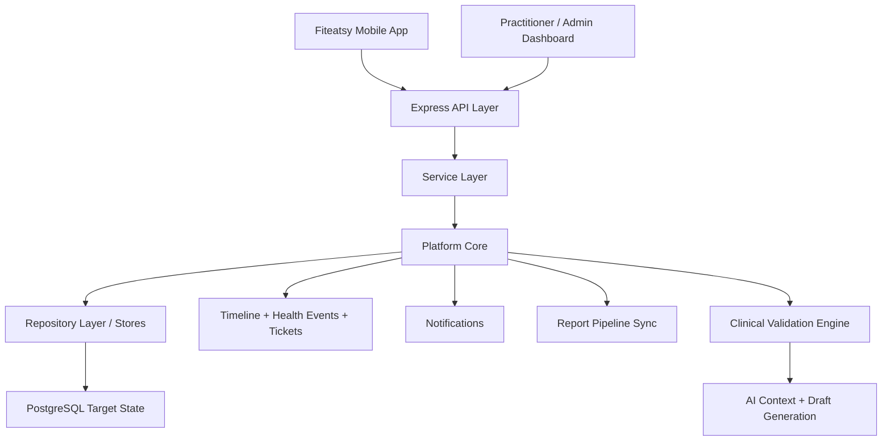
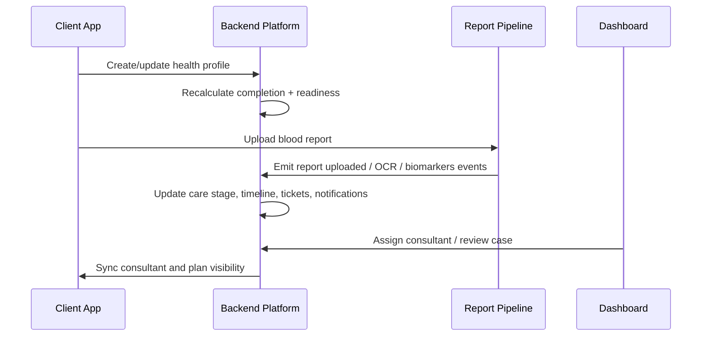

# 02 Platform Architecture

## Purpose

Describe the end-to-end platform structure that connects mobile, backend, reports, AI, and consultant operations.

## Scope

Includes application layers, backend modules, platform core, events, notifications, synchronization, and external operating surfaces.

Related documents:

- [03 Domain Model](/Users/l.paunikar/Desktop/fiteatsy-mobile/docs/03_DOMAIN_MODEL.md)
- [05 API Contract](/Users/l.paunikar/Desktop/fiteatsy-mobile/docs/05_API_CONTRACT.md)
- [06 Event Catalog](/Users/l.paunikar/Desktop/fiteatsy-mobile/docs/06_EVENT_CATALOG.md)

## System Overview

## Architecture Layers

### Platform Core

The platform core organizes the care journey around:

- Health Profile
- Nutrition Profile
- Recovery Program
- Care Case
- Timeline Events
- Health Events
- Health Tickets
- Notifications

### Service Layer

The backend service layer owns:

- profile upserts
- readiness recalculation
- consultant assignment
- stage transitions
- report milestone synchronization

### Repository Layer

Current implementation uses in-memory platform stores for incremental rollout, while the database schema already defines the PostgreSQL target state. The repository contract should remain stable when persistence is swapped.

### API Layer

Express routes expose platform operations under `/v1/platform` and existing product modules under `/v1/auth`, `/v1/reports`, `/v1/checkins`, `/v1/intelligence`, `/v1/nudges`, `/v1/wearables`, and `/v1/employer`.

### Queue Layer

Current code emits report pipeline milestones synchronously. The target architecture should move OCR, biomarker extraction, AI validation, notifications, and downstream recalculation triggers onto durable background jobs.

### Storage Layer

Target storage consists of:

- PostgreSQL for transactional and clinical state
- object storage for report files and attachments
- cache or queue infrastructure for async processing

## Platform Flow

## Authentication

- API routes currently derive user context from headers, body, or query for local development
- Production target should use authenticated session or token claims
- Role-aware access control is required for consultant, mentor, admin, and client actions

## Notifications

Notifications are generated from lifecycle and operational events. Supported channels in the domain are `push`, `in_app`, `email`, and `whatsapp`.

## Timeline

Timeline events are human-readable milestones for case understanding. They are optimized for operational clarity and client/comms history.

## Health Events

Health events are replayable machine-friendly facts used by downstream processors, analytics, and automation.

## Health Tickets

Tickets turn risk, missing data, or follow-up obligations into trackable work for consultants and mentors.

## Care Cases

The care case is the operating shell that binds:

- client identity
- health profile
- recovery program
- assignment
- lifecycle stage
- timeline
- tickets
- plan outputs

## Real-Time Updates

Target-state synchronization should update the mobile app automatically when:

- consultant assignment changes
- care stage changes
- notifications arrive
- reports complete processing
- plans are published

## Responsibilities

- Mobile captures client-facing inputs and renders care visibility
- Backend owns lifecycle, calculations, assignments, and canonical state
- Dashboard acts as the operational console for consultants, mentors, and admins

## Future Expansion Notes

- Move report and AI milestones to queues with retry semantics
- Add websocket or push-driven sync for assignment and ticket changes
- Introduce service boundaries only when module ownership and scale justify it

## Implementation Considerations

- Preserve the route contract while moving from in-memory stores to repository-backed persistence
- Avoid leaking consultant-only terminology into client experiences
