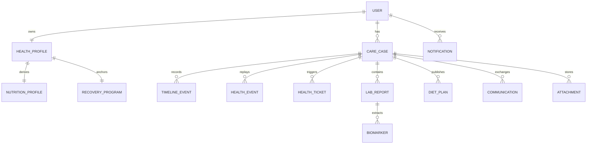

# 03 Domain Model

## Purpose

Define the core business entities, their responsibilities, ownership, and relationships.

## Scope

This document covers client identity, care orchestration, reports, plans, clinical context, and communication entities.

Related documents:

- [02 Platform Architecture](/Users/l.paunikar/Desktop/fiteatsy-mobile/docs/02_PLATFORM_ARCHITECTURE.md)
- [04 Database Architecture](/Users/l.paunikar/Desktop/fiteatsy-mobile/docs/04_DATABASE_ARCHITECTURE.md)
- [07 Care Case Lifecycle](/Users/l.paunikar/Desktop/fiteatsy-mobile/docs/07_CARE_CASE_LIFECYCLE.md)

## Relationship Diagram

## User

Represents a platform identity. The user may be a client, consultant, mentor, or admin depending on context and authorization.

Responsibilities:

- authentication anchor
- ownership root for profile and care data
- recipient of notifications

## Health Profile

The health profile is the canonical client health intake model. It stores DOB, calculated age, gender, body composition, lifestyle, meal behavior, food preferences, conditions, goals, and assignment references.

Responsibilities:

- single source of truth for personal health context
- source for calculated fields such as age, BMI, and waist-to-height logic
- input to readiness, AI, and consultant review

## Nutrition Profile

The nutrition profile is a derived operational artifact representing structured completeness and readiness of the health profile.

Responsibilities:

- section scoring
- missing field visibility
- completion percentage
- AI readiness support

Client-facing naming may use "Health Profile Completion". Consultant-facing naming may use "Nutrition Profile".

## Recovery Program

Represents the active recovery pathway connected to a client’s health profile.

Responsibilities:

- current recovery phase
- consultant and mentor ownership linkage
- umbrella for intervention delivery

## Care Case

The care case is the central operational object representing a live, actionable client program.

Responsibilities:

- current stage
- previous stage
- assignment state
- operational context for tickets, timeline, events, reports, and plans

## Timeline Event

Human-readable milestone associated with a care case.

Responsibilities:

- case chronology
- operational explainability
- UI-ready event history

## Health Event

Replayable structured domain event emitted from care actions and lifecycle changes.

Responsibilities:

- integration substrate
- analytics
- automation and replay

## Health Ticket

Operational work item tied to risk, follow-up, or missing information.

Responsibilities:

- triage
- accountability
- due date and owner tracking

## Report

Lab report uploaded by the client or ingested from another source.

Responsibilities:

- store report metadata and processing progress
- connect report-to-case
- trigger OCR and biomarker extraction

## Biomarker

Structured lab measurement derived from a report.

Responsibilities:

- track measured value and reference range
- support trend analysis
- drive risk and nutrition interpretation

## Diet Plan

Consultant-approved nutrition or recovery output associated with a care case.

Responsibilities:

- capture current version and plan state
- preserve version history
- separate draft, review, and published states

## Clinical Memory

Stored contextual intelligence about repeated patterns, interventions, outcomes, or care learnings.

Responsibilities:

- persist reusable context for AI and consultants
- support continuity across follow-ups

## Communication

Message, note, call summary, or consultation artifact connected to a care case.

Responsibilities:

- preserve conversation history
- support staff collaboration and client communication

## Notification

Delivery artifact for client or staff attention.

Responsibilities:

- track channel and send state
- bridge domain events into user-facing alerts

## Attachment

Generic file or binary reference tied to a case or communication.

Responsibilities:

- support reports, notes, plans, and evidence

## Subscription

Commercial entity that activates or sustains a recovery program.

Responsibilities:

- trigger care-case creation
- support renewals and entitlement checks

## Payment

Financial transaction related to subscription or program purchase.

Responsibilities:

- activate or renew service
- provide revenue visibility to admin views

## Ownership Rules

- User owns Health Profile
- Health Profile anchors Nutrition Profile and Recovery Program
- Care Case owns operational history
- Reports, biomarkers, plans, communications, and tickets are subordinate to Care Case

## Responsibilities By Surface

- Mobile captures and displays client-facing health and care information
- Backend enforces model integrity and lifecycle rules
- Dashboard consumes case-centric views for operations and approvals

## Future Expansion Notes

- Keep commercial entities adjacent to care entities, not embedded inside them
- Add wearable and medication adherence entities through health events first, new tables second

## Implementation Considerations

- Existing front-end types still contain temporary compatibility fields like `age`; these should remain transitional until all clients are fully DOB-backed
- Gender and consultant assignment should not be recollected redundantly once stored in Health Profile
