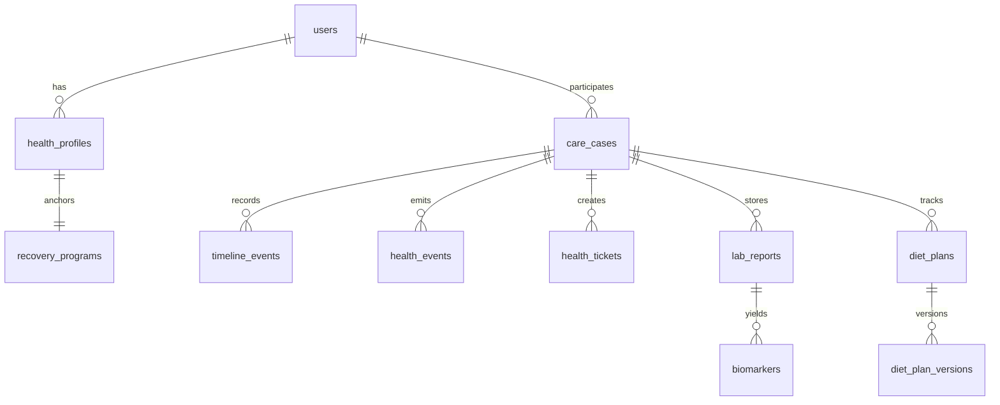

# 04 Database Architecture

## Purpose

Define the target relational model, data integrity patterns, and migration strategy for the Fiteatsy platform.

## Scope

Based on the schema in [`backend/src/db/schema.sql`](/Users/l.paunikar/Desktop/fiteatsy-mobile/backend/src/db/schema.sql), including legacy tables and Phase 1 care-platform tables.

Related documents:

- [03 Domain Model](/Users/l.paunikar/Desktop/fiteatsy-mobile/docs/03_DOMAIN_MODEL.md)
- [05 API Contract](/Users/l.paunikar/Desktop/fiteatsy-mobile/docs/05_API_CONTRACT.md)
- [15 Deployment Guide](/Users/l.paunikar/Desktop/fiteatsy-mobile/docs/15_DEPLOYMENT_GUIDE.md)

## ER Overview

## Table Groups

### Legacy Foundation

- `users`
- `daily_checkins`
- `ai_decision_logs`
- `nudges`
- family-related tables

These remain for continuity and should be progressively integrated rather than abruptly removed.

### Care Platform Tables

- `health_profiles`
- `recovery_programs`
- `care_cases`
- `nutrition_profiles`
- `timeline_events`
- `health_events`
- `health_tickets`
- `lab_reports`
- `biomarkers`
- `diet_plans`
- `diet_plan_versions`
- `clinical_memory`
- `communications`
- `notifications`
- `attachments`

## Relationship Principles

- `health_profiles.user_id` links canonical client health data to `users`
- `care_cases` binds `user_id`, `health_profile_id`, and `recovery_program_id`
- all operational history hangs off `care_case_id`
- report-derived data chains as `care_case -> lab_report -> biomarker`

## Index Strategy

Required indexes in production:

- `health_profiles(user_id, status)`
- `care_cases(user_id, current_stage, status)`
- `timeline_events(care_case_id, event_time desc)`
- `health_events(care_case_id, event_time desc)`
- `health_tickets(care_case_id, ticket_status, priority)`
- `lab_reports(user_id, report_date desc)`
- `biomarkers(care_case_id, biomarker_name, created_at desc)`
- `notifications(user_id, sent_at desc, status)`

## Audit Fields

Every Phase 1 platform table includes:

- status
- version
- `created_at`
- `updated_at`
- `deleted_at`

These enable soft delete, optimistic concurrency, forensic history, and low-risk migrations.

## Soft Delete

Soft delete is the default for operational and clinical records. Hard delete should be reserved for approved privacy erasure workflows.

## Versioning

- Row version supports safe updates
- `diet_plan_versions` stores plan evolution explicitly
- Timeline and health events preserve change history separately from current row state

## Migration Strategy

1. Keep old tables functional while platform repositories mature
2. Backfill canonical health profile fields from mobile and onboarding data
3. Derive approximate DOB from historical age only as a compatibility bridge
4. Move platform services from in-memory stores to PostgreSQL repositories without changing route contracts
5. Add backfills for consultant assignment history and timeline reconstruction as needed

## Normalization Guidance

- Structured scalars should live in typed columns
- Flexible repeated fields such as food preferences may remain JSONB arrays
- Event metadata may remain JSONB, but event type and ownership must stay relational

## Responsibilities

- Database stores canonical operational and clinical state
- Services maintain integrity and denormalized projections
- Analytics should read from domain events or curated marts, not ad hoc app tables

## Future Expansion Notes

- Introduce partitioning for high-volume event tables when scale justifies it
- Add dedicated assignment-history and consultation tables when workflows deepen

## Implementation Considerations

- The current Phase 1 backend uses in-memory platform stores; this document describes the persisted target state and therefore should guide the repository transition
