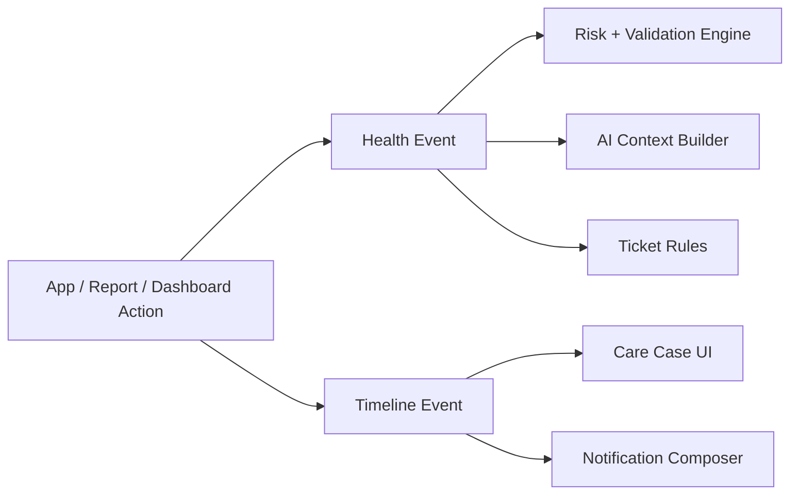

# 06 Event Catalog

## Purpose

Define the canonical event vocabulary used for timeline, automation, notifications, analytics, and AI context building.

## Scope

Covers platform lifecycle events, report pipeline events, behavioral health events, and their operational side effects.

Related documents:

- [02 Platform Architecture](/Users/l.paunikar/Desktop/fiteatsy-mobile/docs/02_PLATFORM_ARCHITECTURE.md)
- [07 Care Case Lifecycle](/Users/l.paunikar/Desktop/fiteatsy-mobile/docs/07_CARE_CASE_LIFECYCLE.md)
- [08 Clinical Validation Engine](/Users/l.paunikar/Desktop/fiteatsy-mobile/docs/08_CLINICAL_VALIDATION_ENGINE.md)

## Event Model

There are two complementary event layers:

- Timeline events: human-readable case chronology
- Health events: replayable machine-oriented facts

## Core Lifecycle Events

| Event | Publisher | Subscribers | Timeline Impact | Ticket Impact | Notification Impact |
| --- | --- | --- | --- | --- | --- |
| `registration` | auth/onboarding | care-case core | yes | possible `new_client` | welcome / activation |
| `assessment_completed` | mobile assessment | validation engine | yes | may remove intake gaps | optional |
| `health_profile_updated` | platform service | readiness engine, dashboard | yes | may resolve missing profile tickets | optional |
| `consultant_assigned` | assignment service | mobile, dashboard | yes | may create or resolve coordination tasks | yes |
| `stage_changed` | lifecycle engine | notifications, dashboard, analytics | yes | stage-specific rules | yes |

## Report Pipeline Events

| Event | Publisher | Subscribers | Timeline | Ticket | Notification |
| --- | --- | --- | --- | --- | --- |
| `REPORT_UPLOADED` / `blood_report_uploaded` | reports module | platform core | yes | may clear pending report gap | client confirmation |
| `OCR_COMPLETED` / `ocr_completed` | OCR worker | validation engine | yes | none by default | optional |
| `BIOMARKERS_UPDATED` / `biomarkers_updated` | biomarker parser | risk engine, AI context | yes | may create `biomarker_alert` | optional |
| `AI_VALIDATION_COMPLETED` | report intelligence | consultant workspace | optional | may create review task | optional |

## Plan And Care Events

| Event | Publisher | Subscribers | Timeline | Ticket | Notification |
| --- | --- | --- | --- | --- | --- |
| `DIET_GENERATED` | AI drafting service | consultant UI | optional | review task | no direct client push |
| `diet_published` / `DIET_PUBLISHED` | consultant workflow | mobile, analytics | yes | resolves draft review tasks | yes |
| `FOLLOWUP_COMPLETED` / `followup_completed` | consultant / mentor | lifecycle engine | yes | resolves follow-up ticket | yes |

## Behavioral Health Events

Supported machine events include:

- `medication_logged`
- `meal_logged`
- `water_logged`
- `sleep_logged`
- `exercise_logged`
- `cycle_updated`
- `mood_logged`
- `chat_sent`
- `voice_note_uploaded`

These may or may not be promoted into visible timeline items depending on product value and noise level.

## Payload Rules

Every health event should include:

- `careCaseId`
- `userId`
- event type
- `eventTimeISO`
- stable `replayKey`
- typed payload object

Every timeline event should include:

- title
- detail
- display time
- metadata for drill-down or linking

## Event Processing Rules

1. Emit events for meaningful care or operational facts, not every UI interaction.
2. Prefer immutable event append over destructive mutation history.
3. Notification fan-out should subscribe to events rather than duplicate business logic.
4. AI context should consume event streams through curated aggregations, not raw unbounded timelines.

## Architecture Diagram

## Responsibilities

- Source module publishes
- platform core normalizes and persists
- subscribers derive tickets, notifications, metrics, and AI context

## Future Expansion Notes

- Introduce a formal event registry with versioned schemas
- Separate internal event names from external webhook event names if integrations expand

## Implementation Considerations

- Current code contains both lowercase domain kinds and some uppercase conceptual names; standardization should converge without losing backward compatibility
