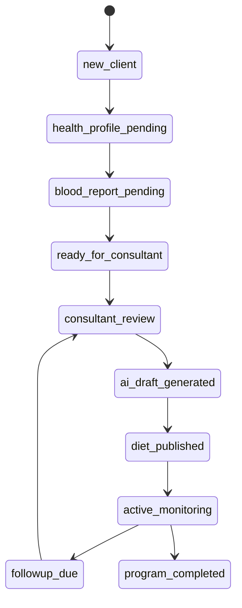

# 07 Care Case Lifecycle

## Purpose

Define the full life of a client care case, including stage transitions, permissions, validation rules, notifications, and ticket behavior.

## Scope

Based on the `CareCaseStage` model implemented in the platform backend.

Related documents:

- [03 Domain Model](/Users/l.paunikar/Desktop/fiteatsy-mobile/docs/03_DOMAIN_MODEL.md)
- [06 Event Catalog](/Users/l.paunikar/Desktop/fiteatsy-mobile/docs/06_EVENT_CATALOG.md)
- [08 Clinical Validation Engine](/Users/l.paunikar/Desktop/fiteatsy-mobile/docs/08_CLINICAL_VALIDATION_ENGINE.md)

## State Machine

## Stage Definitions

### `new_client`

Created after enrollment or activation. Core identity exists, but actionable care context is not yet complete.

### `health_profile_pending`

Health Profile is incomplete. Client or consultant follow-up is required.

### `blood_report_pending`

Profile is materially complete, but report evidence is still missing or insufficient.

### `ready_for_consultant`

The case is ready to enter active consultant workflow.

### `consultant_review`

Human review is underway using profile, reports, biomarkers, and existing history.

### `ai_draft_generated`

AI has generated a draft or structured recommendation set, pending human review.

### `diet_published`

A consultant-approved plan has been issued.

### `active_monitoring`

Client is actively following the program and generating adherence or follow-up signals.

### `followup_due`

A review or intervention refresh is due based on elapsed time, progress, or risk.

### `program_completed`

The active recovery cycle has concluded.

## Transition Rules

- Only backend lifecycle logic may change stages
- Transitions should be triggered by profile completion, report milestones, consultant actions, or follow-up timers
- Each valid transition must emit a `stage_changed` timeline event and health event

## Permission Model

- Client may update health profile and upload reports
- Consultant may review, draft, revise, publish, and log follow-up outcomes
- Mentor may review escalations and high-risk cases
- Admin may inspect operational state and assignment quality, but not bypass clinical publication controls

## Validation Rules

- `health_profile_pending -> blood_report_pending` requires sufficient core profile completion
- `blood_report_pending -> ready_for_consultant` requires report presence or an approved exception rule
- `consultant_review -> ai_draft_generated` requires AI readiness and enough structured context
- `ai_draft_generated -> diet_published` requires human approval

## Notifications

Examples:

- missing health profile reminders
- report upload acknowledgement
- consultant assignment notifications
- plan publication alert
- follow-up due reminder

## Timeline And Ticket Effects

| Stage / Transition | Timeline | Ticket |
| --- | --- | --- |
| new client created | add registration event | create `new_client` |
| missing profile identified | add update or request event | create `missing_health_profile` |
| report uploaded | add report event | resolve pending report gap if applicable |
| consultant assigned | add assignment event | assign ownership |
| follow-up becomes due | add stage event | create `followup_due` |

## Recovery Stage Philosophy

Lifecycle stages should represent operational readiness and care responsibility, not vague activity labels.

## Responsibilities

- Lifecycle engine owns transitions
- Tickets own actionability
- Timeline owns explainability
- Notifications own user attention

## Future Expansion Notes

- Add paused, on-hold, and dropout semantics only when their workflow is clearly distinct
- Add assignment-history transitions as first-class lifecycle metadata

## Implementation Considerations

- The intended semantics for `stage_changed` metadata are previous and next stage values, even if a local Phase 1 smoke test exposed a temporary duplicate-stage bug in metadata
