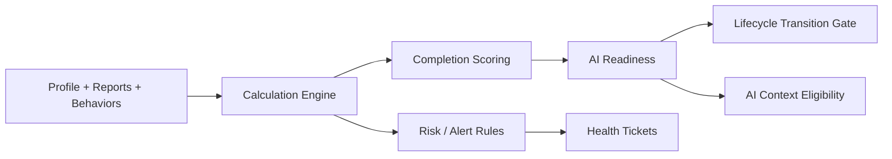

# 08 Clinical Validation Engine

## Purpose

Document how Fiteatsy evaluates data completeness, readiness, risk, and decision support before consultant action or AI drafting.

## Scope

Includes the readiness engine, calculation engine, risk/ticket generation concepts, and progress metrics.

Related documents:

- [06 Event Catalog](/Users/l.paunikar/Desktop/fiteatsy-mobile/docs/06_EVENT_CATALOG.md)
- [07 Care Case Lifecycle](/Users/l.paunikar/Desktop/fiteatsy-mobile/docs/07_CARE_CASE_LIFECYCLE.md)
- [10 AI Architecture](/Users/l.paunikar/Desktop/fiteatsy-mobile/docs/10_AI_ARCHITECTURE.md)

## Validation Pipeline

## Calculation Engine

Backend-owned calculations currently include:

- `calculateAgeFromDob`
- `calculateBmi`
- `calculateWaistToHeightRatio`
- `calculateNutritionProfileCompletion`

These functions must remain deterministic, audited, and portable across API consumers.

## Readiness Engine

The readiness engine converts structured completeness into operational readiness.

Current ingredients include:

- health profile completion
- presence of blood reports
- meal behavior coverage
- food profile coverage

Current implementation threshold:

- `aiReady = readinessScore >= 75`

## Nutrition Profile Completion

The derived nutrition profile contains:

- `completionPercent`
- `readinessScore`
- `aiReady`
- `missingFields`
- section scores by domain segment

Client-facing mobile surfaces should present this concept as "Health Profile Completion".

## Risk Engine

The risk engine should evaluate:

- missing core profile fields
- biomarker out-of-range signals
- medication non-adherence
- low recovery score
- overdue follow-up

Its immediate outputs are:

- health tickets
- notification triggers
- consultant prioritization cues

## Decision Engine

The decision engine governs:

- whether a care case progresses
- whether AI drafting is permitted
- whether a mentor escalation is warranted

## Clinical Alerts

Alerts should be structured rather than freeform, for example:

- `biomarker_alert`
- `medication_non_adherence`
- `low_recovery_score`
- `followup_due`

## Recovery Score

Recovery score is a broader longitudinal measure that should eventually combine:

- biomarker trend direction
- adherence quality
- sleep, hydration, movement, and mood signals
- follow-up outcomes

## Program Progress

Program progress is not the same as profile completion. It measures movement through the care lifecycle and ongoing adherence after plan publication.

## Responsibilities

- Backend computes canonical validation state
- Dashboard consumes scores and missing fields
- Mobile surfaces completion, gaps, and next actions

## Future Expansion Notes

- Add configurable rule engine support for condition-specific validations
- Version readiness logic so historical case decisions remain explainable

## Implementation Considerations

- Do not let client-side completion widgets become authoritative
- Validation outputs must remain interpretable to consultants, not just mathematically correct
