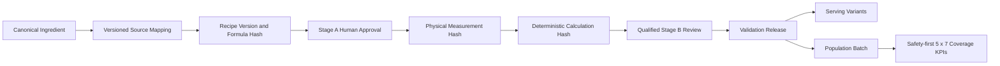

# Fiteatsy Canonical Ingredient and Recipe Foundation v1

Status: candidate-only. This foundation does not activate Food Knowledge or alter Diet Plan, Eating Out, Craving, What Can I Eat Now, Consumption, or production data.

## Architecture

## Canonical ingredient registry

An ingredient identity is stable over canonical name, physical form, preparation state, species/variety, grade and nutrient basis. Null is explicit and never coerced to a plausible default. Duplicate normalized identities are rejected by the identity hash.

## Reusable source mapping and approval reuse

Source records are separate from ingredients. Each mapping pins dataset/source, record, release, raw nutrient payload, source hash and an identity snapshot. Decisions are `PENDING`, exact, equivalent, measured-local, rejected, or no-acceptable-source. Approval requires rationale, reviewer identity, qualification and timestamp. It is reusable only when every identity dimension and nutrient basis match; otherwise eligibility fails closed. Supersession is append-only and retains history.

## Recipe and deterministic lineage

Recipe versions contain ordered formula lines and a formula hash. Stage A approval, physical measurement, calculation, Stage B review and validation release remain separate objects. A material formula change creates a new version/hash; it cannot inherit downstream approval. Unknown/not-reported nutrients remain null, while a verified numeric zero remains zero.

## Human-gate ingestion

The ingestion report is machine-readable and rejects missing reviewer metadata, unsupported or pending decisions, missing rationale, partial/unknown items, duplicate/conflicting decisions, stale task hashes, changed evidence hashes and unacknowledged supersession. It never infers reviewer authority or a decision.

## Population batches and coverage

Population is staged through immutable batch manifests with draft, validating, accepted or rejected state. Coverage runs bind the client profile, required option count and result hash. KPIs include distinct canonical Foods, distinct families, serving-variant depth, per-meal shortage, exact 5-option coverage across seven meal heads, and explicit 2,101 kcal / 131 g protein profile context. Counts are evidence, not permission to activate production.

## Serving variants

Serving variants derive from one accepted validation release and scale its per-100-g nutrient vector. They are not duplicate Foods and cannot exist without their release lineage.

## Safety and ranking

Hard diet, allergen and avoid constraints filter canonical candidates before ranking. Ineligible candidates never consume limits. Shortages are reported truthfully; the engine does not pad duplicates.

## Current Batch 1 gate

Physical evidence is preserved, but Stage A decisions and source identity decisions remain pending. Therefore formula hashes, canonical measurement runs, calculations, Stage B approvals and validation releases remain zero. No human decision is simulated or self-approved.

## Rollout and rollback

Rollout: migrate additively, populate registry in a non-production candidate environment, ingest genuine human decisions, build governed lineage, validate batches, then request separate activation approval. Rollback before activation is to stop writers and leave additive tables dormant; published historical catalogue and Diet references remain untouched. Never delete accepted lineage to roll back.

## Future Indian-food population

Use governed waves for staples, proteins, sabji, small meals, eating-out foods, supported non-vegetarian foods and evidence-led gap closure. Each item must resolve ingredient identity, rights/provenance, formula, measurements, nutrition, review, serving and contextual metadata before batch acceptance.
