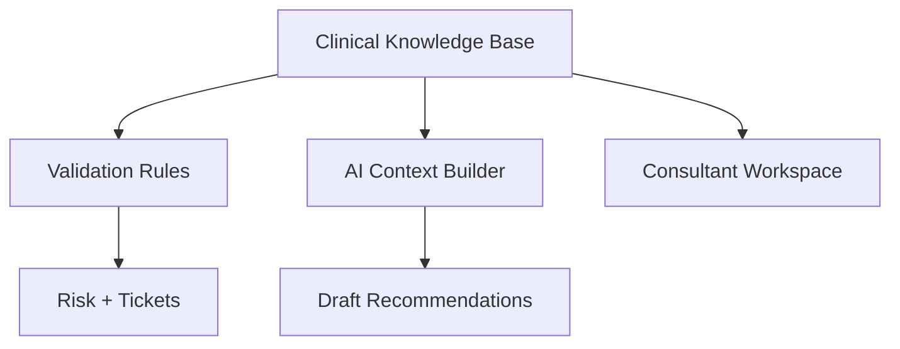

# 09 Clinical Knowledge Base

## Purpose

Define how structured healthcare knowledge is stored, versioned, and consumed by consultants and AI systems.

## Scope

This document defines storage architecture and governance, not medical content itself.

Related documents:

- [08 Clinical Validation Engine](/Users/l.paunikar/Desktop/fiteatsy-mobile/docs/08_CLINICAL_VALIDATION_ENGINE.md)
- [10 AI Architecture](/Users/l.paunikar/Desktop/fiteatsy-mobile/docs/10_AI_ARCHITECTURE.md)
- [17 Decision Log](/Users/l.paunikar/Desktop/fiteatsy-mobile/docs/17_DECISION_LOG.md)

## Why A Separate Knowledge Base Exists

Clinical knowledge must be curated, versioned, and reviewable independent of generative AI. AI may consume knowledge, but must not define the knowledge source itself.

## Knowledge Domains

- Disease Library
- Biomarker Library
- Food Library
- Recipe Library
- Supplement Library
- Medication Library
- Clinical Rules
- Nutrition Rules
- Reference Ranges
- Recovery Protocols

## Storage Model

Recommended structure:

- canonical knowledge entities in relational tables
- versioned rule payloads in JSONB where appropriate
- provenance metadata including author, reviewer, effective date, and superseded version

## Reference Architecture

## Entity Design Guidance

Each knowledge object should support:

- stable identifier
- brand applicability
- target condition or biomarker
- rule or recommendation text
- version and review status
- clinical owner
- effective window

## Rule Categories

- contraindication rules
- biomarker interpretation rules
- meal composition rules
- protocol selection rules
- escalation rules
- consultant approval rules

## Governance

- clinical teams author and review
- engineering operationalizes rule execution and retrieval
- AI consumes approved knowledge snapshots, not mutable drafts

## Responsibilities

- provide safe reference context
- enable consistent consultant and AI behavior
- separate medical logic from prompt wording

## Future Expansion Notes

- introduce regional cuisine variants, supplement interactions, and medication-food interactions
- add mentor-reviewed exception libraries and outcome annotations

## Implementation Considerations

- Avoid storing critical knowledge only inside prompts or application code
- Clinical knowledge updates should be deployable and auditable independent of UI changes
