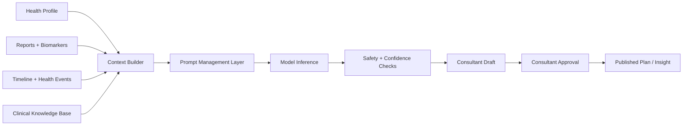

# 10 AI Architecture

## Purpose

Define how AI participates in the Fiteatsy platform while staying clinically constrained, observable, and human-supervised.

## Scope

Includes context building, prompt orchestration, recommendation generation, safety boundaries, and approval workflows.

Related documents:

- [08 Clinical Validation Engine](/Users/l.paunikar/Desktop/fiteatsy-mobile/docs/08_CLINICAL_VALIDATION_ENGINE.md)
- [09 Clinical Knowledge Base](/Users/l.paunikar/Desktop/fiteatsy-mobile/docs/09_CLINICAL_KNOWLEDGE_BASE.md)
- [11 Security](/Users/l.paunikar/Desktop/fiteatsy-mobile/docs/11_SECURITY.md)

## AI Pipeline

## Context Builder

The context builder should assemble:

- canonical health profile
- nutrition profile and missing fields
- biomarker summaries and trends
- recent health events and adherence signals
- clinical knowledge references
- current care-case stage and ticket state

## Prompt Management

Prompts should be:

- versioned
- role-specific
- task-specific
- auditable

Example task classes:

- report interpretation
- recovery summary generation
- diet draft generation
- follow-up suggestion generation

## Clinical Memory

Clinical memory stores repeated learnings and prior interventions so AI can reason with continuity instead of stateless snapshots.

## Recommendation Engine

AI recommendations should be modular rather than monolithic:

- diagnosis-neutral observation
- likely driver hypotheses
- meal or routine block suggestions
- follow-up questions
- escalation flags

## Diet Generation

AI may generate a consultant draft, but:

- it must respect readiness thresholds
- it must use structured context
- it must not bypass consultant approval

## Report Interpretation

AI can help summarize:

- abnormal biomarkers
- likely nutrition implications
- follow-up priorities

Interpretation should remain traceable to extracted biomarker facts and reference rules.

## Recovery Intelligence

AI should eventually help identify:

- adherence breakdown patterns
- intervention-response patterns
- likely next best actions

## AI Guardrails

- no autonomous publishing
- no unsupported medical claims
- no use of unapproved knowledge sources as clinical truth
- no hallucinated biomarker values or history

## Confidence

Confidence should combine:

- data completeness
- extraction reliability
- rule match strength
- prior intervention continuity

Low-confidence outputs must be visibly labeled and may require mentor review.

## Human Approval

Consultants remain accountable for:

- validating AI summaries
- editing or rejecting AI drafts
- publishing the final plan

## Responsibilities

- Backend builds context and enforces guardrails
- Dashboard renders reviewable drafts
- Clinical leadership defines acceptable AI boundaries

## Future Expansion Notes

- Add outcome feedback loops to measure which AI suggestions improve care quality
- Add formal evaluation harnesses against curated clinical scenarios

## Implementation Considerations

- Keep AI architecture decoupled from any single model vendor
- Preserve prompt and output audit logs for safety, debugging, and review
