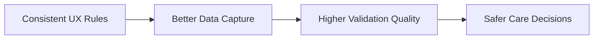

# 12 UX Principles

## Purpose

Document the UX rules that keep Fiteatsy accessible, consistent, and clinically trustworthy without redesigning established product language unnecessarily.

## Scope

Applies to mobile, dashboard, client onboarding, data collection flows, reports, and staff workspaces.

Related documents:

- [00 Product Constitution](/Users/l.paunikar/Desktop/fiteatsy-mobile/docs/00_PRODUCT_CONSTITUTION.md)
- [01 Product Vision](/Users/l.paunikar/Desktop/fiteatsy-mobile/docs/01_PRODUCT_VISION.md)
- [13 Development Guidelines](/Users/l.paunikar/Desktop/fiteatsy-mobile/docs/13_DEVELOPMENT_GUIDELINES.md)

## Visual System Direction

- Respect the established visual language, dark/light themes, spacing, typography rhythm, and animations
- Prefer targeted UX improvements over redesign
- Use Material 3 patterns where they improve behavior, accessibility, and predictability

## Accessibility

- WCAG compliance is mandatory
- text on dark surfaces must maintain strong contrast
- interactive elements must expose clear labels and focus states
- motion should never hide meaning or block task completion

## Typography

- Maintain consistent type scale and weights across screens
- Use legible body text, especially on grey and dark cards
- Avoid using low-contrast grey text on grey surfaces

## Spacing

- Use consistent spacing tokens
- Preserve predictable rhythm between headings, cards, lists, and actions

## Motion

- Motion should communicate state transition, not ornamentation
- Use restrained stagger and sheet transitions
- Loading states must not imply incorrect completion

## Cards

- Cards should group semantically related data
- Cards containing key health or action information must preserve contrast and scanability

## Bottom Sheets

- Use bottom sheets for edit, inspect, and focused completion tasks
- Ensure drag, dismiss, and keyboard states remain stable

## Dialogs

- Reserve dialogs for confirmation, risk acknowledgement, or destructive actions
- Prefer inline guidance for routine edits

## Forms

- Remove redundant questions
- Reuse canonical profile data rather than recollecting it
- Numeric health measurements should use native-feeling, accessible wheel interactions

## Tables

- Staff tables should support filtering, scanability, and row-level action clarity
- Time filtering for admin intelligence should align client list and metrics together

## Charts

- Use charts to show trend and risk only when the underlying signal is meaningful
- Never hide exact values behind decoration alone

## Responsive Design

- Mobile screens should remain thumb-friendly and legible on smaller devices
- Dashboard layouts should preserve prioritization on laptop widths before expanding on large screens

## Offline UX

- Capture should degrade gracefully when network is unavailable
- Sync state should be explicit for report uploads, profile edits, and adherence logs

## Loading States

- Loading should preserve layout where possible
- Progress states should reflect true backend stages for uploads and analysis

## Empty States

- Empty states should tell the user what is missing and what action unblocks progress
- In care workflows, empty states should map to lifecycle meaning, not generic placeholders

## Error States

- Errors should be specific, calm, and actionable
- Validation errors should identify missing or invalid fields clearly

## Architecture Diagram

## Responsibilities

- Design sets reusable interaction patterns
- Engineering implements them consistently
- Product removes redundant steps and conflicting terminology

## Future Expansion Notes

- Formalize component-level accessibility checklists for both mobile and dashboard
- Add documented chart and table patterns for the practitioner intelligence workspace

## Implementation Considerations

- Preserve the current home screen unless explicitly requested otherwise
- For dark mode, prioritize white or high-contrast text on mixed grey surfaces
