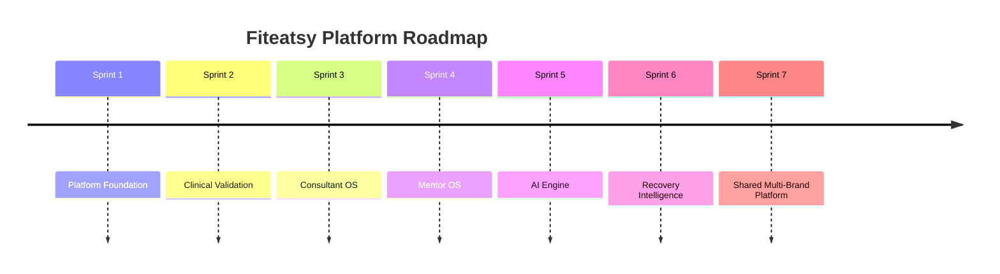

# 16 Product Roadmap

## Purpose

Provide the sequencing logic for platform evolution so teams can prioritize without losing architectural coherence.

## Scope

Covers platform foundation, clinical validation, consultant systems, AI, and brand convergence.

Related documents:

- [01 Product Vision](/Users/l.paunikar/Desktop/fiteatsy-mobile/docs/01_PRODUCT_VISION.md)
- [02 Platform Architecture](/Users/l.paunikar/Desktop/fiteatsy-mobile/docs/02_PLATFORM_ARCHITECTURE.md)
- [17 Decision Log](/Users/l.paunikar/Desktop/fiteatsy-mobile/docs/17_DECISION_LOG.md)

## Roadmap Overview

## 1. Platform Foundation

- canonical health profile
- nutrition profile readiness
- care case lifecycle
- timeline, tickets, notifications
- report pipeline integration

## 2. Clinical Validation

- richer rule-based readiness and risk scoring
- biomarker validation logic
- condition-aware escalation pathways

## 3. Knowledge Base

- structured clinical libraries
- rule versioning
- approval workflow for knowledge updates

## 4. Consultant OS

- unified client workspace
- plan review and publishing
- communication and note systems
- nutrition profile and trend intelligence

## 5. Mentor OS

- escalation review
- consultant quality oversight
- risk and intervention audits

## 6. AI Engine

- context builder
- prompt registry
- guarded report interpretation
- consultant draft generation

## 7. Recovery Intelligence

- adherence trend detection
- personalized follow-up timing
- outcome-aware intervention suggestions

## 8. Nuetra And Shared Platform

- shared core domain model
- brand-specific surfaces on common care architecture
- reusable event, security, and AI foundations

## 9. Future Integrations

- labs and LIMS connectors
- calendar and wearable enrichment
- teleconsultation and communication channels
- payment and subscription orchestration

## Responsibilities

- Product sequences user value
- Engineering preserves platform cohesion
- Clinical teams approve the safety envelope of expanding automation

## Future Expansion Notes

- roadmap should remain modular enough for brand-specific release trains without domain fragmentation

## Implementation Considerations

- prioritize persistence migration and contract hardening before widening AI or dashboard complexity
